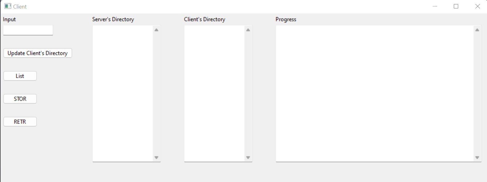

# README

## Introduction

A representation of FTP—File Transfer Protocol-which is used in computer networks.

## Installation

```markdown
pip install -r requirements.txt
```

## Running The Application

Run the following commands in two independent terminals.

```markdown
cd ./Server
py server.py
```

```markdown
cd ./Client
py client.py
```

## Usage

After running `[client.py](http://client.py)` file, you will see a window like this:



This window was implemented to help get to know the use of FTP.

Here are some steps and approaches that can help you to work with this repository.


